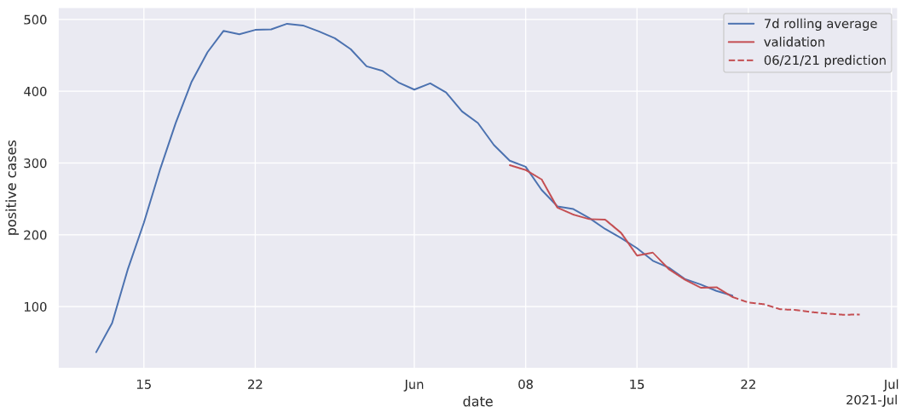

# TW COVID-19 Daily Announcements

This is a simple project to practice some coding and analytics using Python and MongoDB. The dev environment is completely containerized that consists of a vscode Python 3 remote dev container and a MongoDB container for data storage.

To use the repository
1. Have local vscode and docker environment properly installed and tested. (vscode need to be able to install extensions, and docker host can download, build and run images from internet)
2. Download the repository to a working directory and maintain the structures, including subdirectories .devcontainer, .vscode and data
3. Open the working directory in vscode
4. Press F1 and select "Remote-Containers: Open folder in Container"
5. Wait the scripts to build the two containers and setup the connection
6. Open "pymongoa.py" to run (recommend to run in Interactive Window, so the plots can display properly).

The data was extracted daily from the TW CDC website (2021/05/09 ~ 2021/06/24) and stored in Json files, with the following details 
- date
- confirmed positive case number
- death toll (if any)
- correction amounts (if any)
- corrections (if any)
    - date
    - updated case number

Daily Positive Case Chart
 

The document-based MongoDB is well suited to store and serve as the DB for this type of daily announcements. The item and content in the announcements can vary from day to day. Without predefined schema and can adjust dynamically provides a huge advantage for dynamic analysis. The use of pymongo library is simple enough. The combination is very handy for adhoc analysis, even machine learning.

The use of vscode "Remote Development" saves a lot of time to setup environments. With everything containerized, remote development should be the way to go.

A simple ARIMA model got fit to the "7 Days Rolloing Avg" of the corrected daily case number. No data split for testing (since this is just a quick example). 7 days forecast are calcualte from the model and put on the same chart. 

Example, model validation and forecast
 

[6/24/2021] Two additional containers were used to execute the code quality scan
1. $ docker run -d --name sonarqube \
     -e SONAR_ES_BOOTSTRAP_CHECKS_DISABLE=true \
     -p 9000:9000 \
     sonarqube:latest
2. $ docker run --rm --name sonarscanner \
    -e SONAR_HOST_URL="http://host.docker.internal:9000" \
    -e SONAR_LOGIN="e4ce107282f15903f65d02a889a8d31c1e73f7a8" \
    -v "$(pwd)":/usr/src \
    sonarsource/sonar-scanner-cli

After the installation and start of sonarqube server, follow the instruction to create twcovid project and login credential. Update the SONAR_LOGIN credential and edit the content of sonar-project.properties if needed. Start the sonar-scanner container to execute the code quality scan. Access the report on sonarqube server under project twcovid.

[7/8/2021] Use plotly Dash opensource package to create a Web App. 

The app.py was added as the entry point of the Web App. Python codes were also packaged under "twc" module and split into three function files, i.e. tcdata, tcmodel, and tcplot. This is a more production like coding style.
